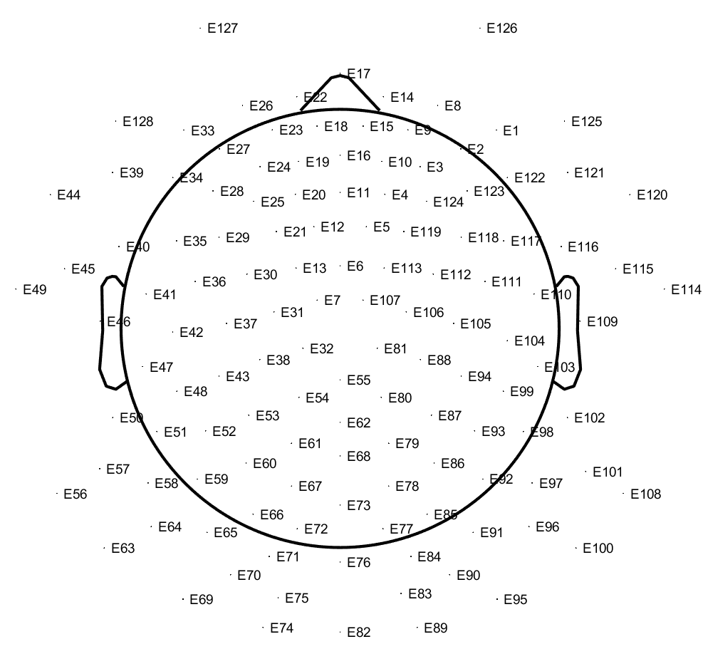

# 计算神经大作业

- `preprocess`目录进行预处理操作；

> 预处理过程的数据文件太大上传不上，只上传一部分和预处理完成的数据。

- `feature_extraction`目录进行特征提取操作；

- `feature_select`目录进行特征选择操作；

- `classify`进行分类操作；

- `img`存放实验过程的截图和实验结果的统计图。

## 实验数据

本文采用的数据集是[MODMA](https://repod.icm.edu.pl/dataset.xhtml?persistentId=doi:10.18150/repod.0107441)数据集。该数据集采集了包括24名主要抑郁症患者(女/男=11/13,30.88±10.37岁)和29名健康对照受试者(女/男=9/20,31.45±9.15岁)在内的128通道的静息态脑电记录，受采集者的年龄都在18-55区间内。使用128通道HydroCel测地线传感器网和Net Station采集软件(版本4.5.4)记录5分钟闭眼静息状态脑电图。采样频率为250hz。所有的原始电极信号都参考了Cz。各电极阻抗保持在50以下kΩ。多通道脑电信号采集于安静、隔音、通风良好、无强电磁的房间。出于时间性能和计算效率的考虑，我们选择了16个电极(Fp1/2、F3/4、C3/4、P3/4、O1/2、F7/8、T3/4、T5/6)，而不是128个电极。

